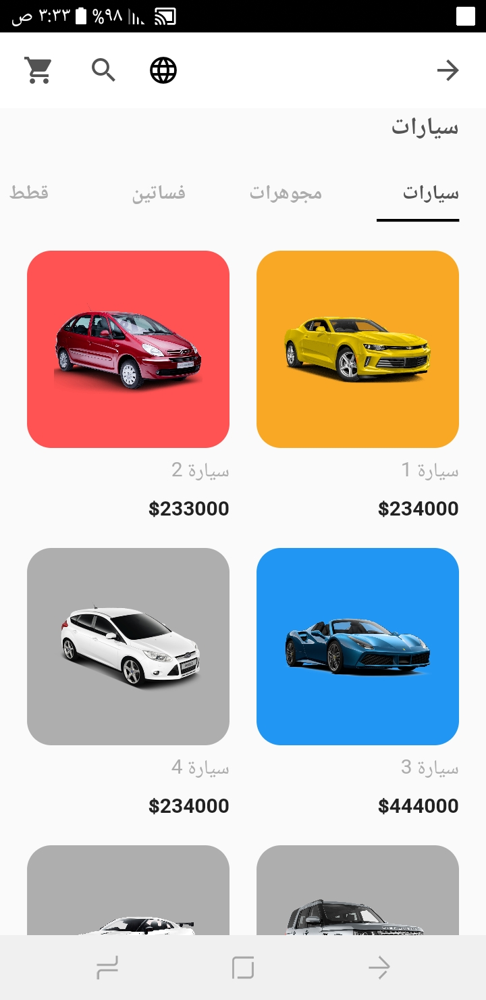
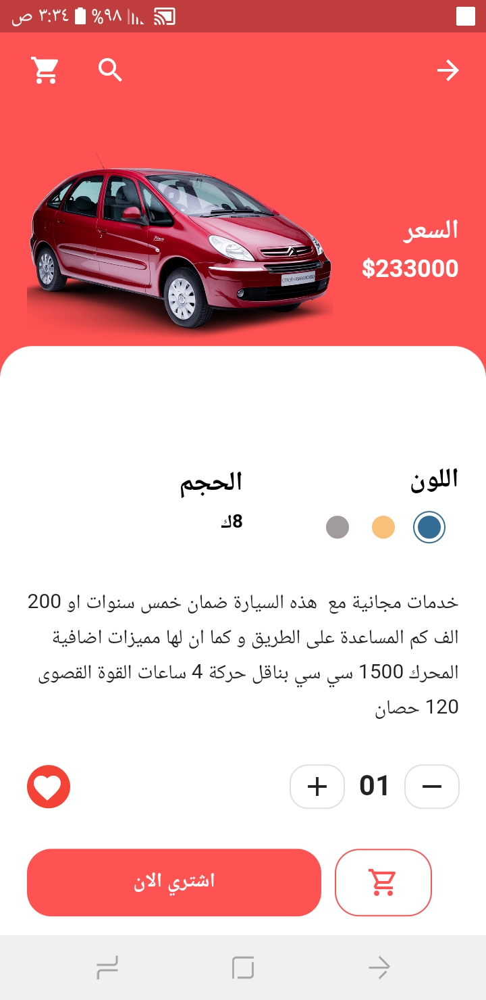
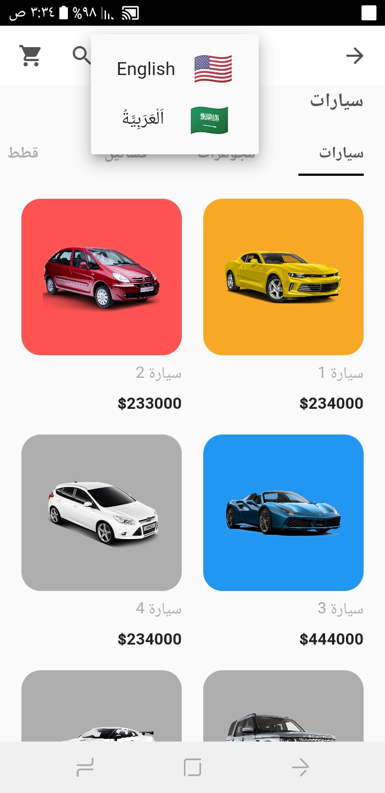
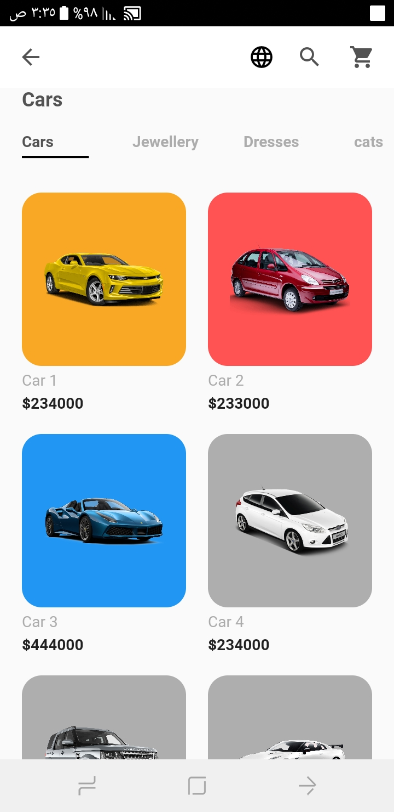
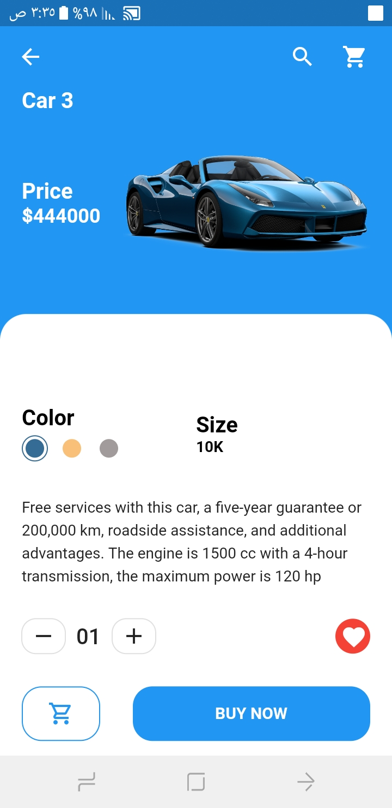

# online_shop_app_ui_app

On our E-commerce app UI has two pages one for the product page which has a horizontal list of categories then a list of our products. Then on the details page, 
it shows the price and short description of the product with the Buy Now button. The best part of our E-commerce app is,
each product has its own color which looks great.
In addition to that it has two languages Arabic and English.

## some vidoes
<!-- record_1 -->

## Screenshots

   
 
    

  
